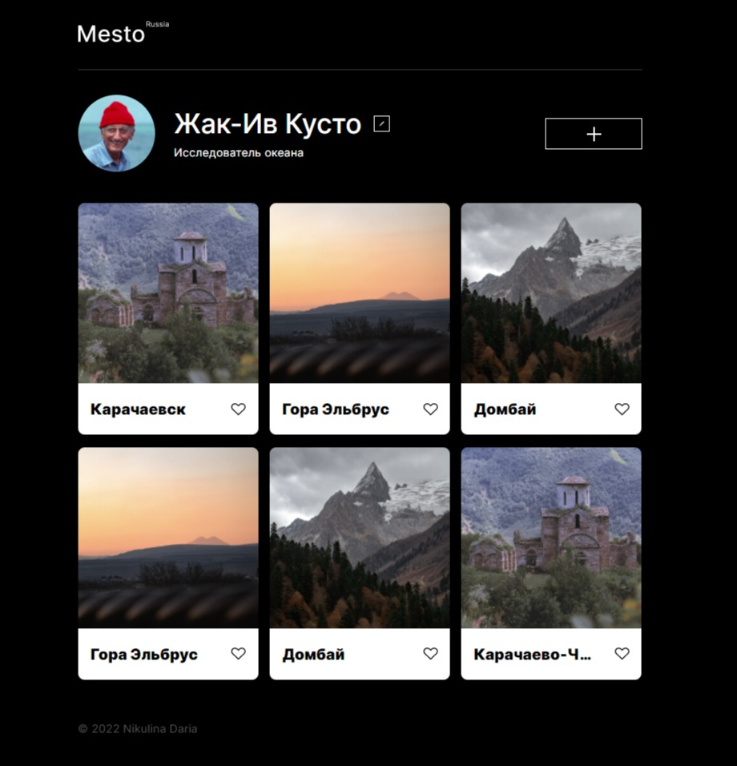

# Mesto

Галерея изображений, которую можно редактировать: добавлять и удалять фотографии, менять данные профиля, ставить лайки.

[Ссылка на проект на Github Pages](https://n-daria.github.io/mesto/)

## Используемые технологии
 1. HTML5, CSS3
 2. БЭМ
 3. Адаптивная верстка
 4. Flexbox, grid
 5. PixelPerfet
 6. JavaScript
 7. ООП
 8. Валидация форм
 9. Серверные запросы

  

## Инструкцию по развертыванию проекта

git clone https://github.com/N-Daria/mesto.git  
cd mesto  
npm i   
npm run build  
npm start  

## Планы по доработке проекта

1. Добавить возможность изменять внешний вид галереи (светлая/темная темы). 
